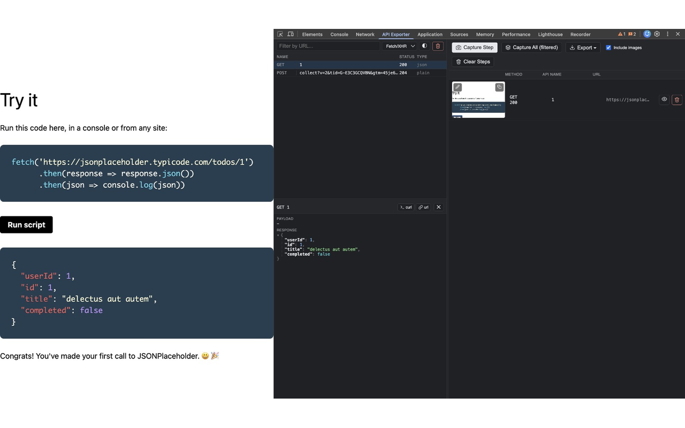
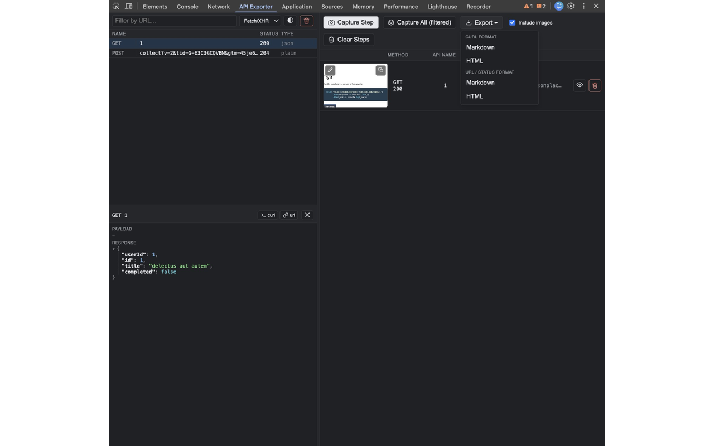
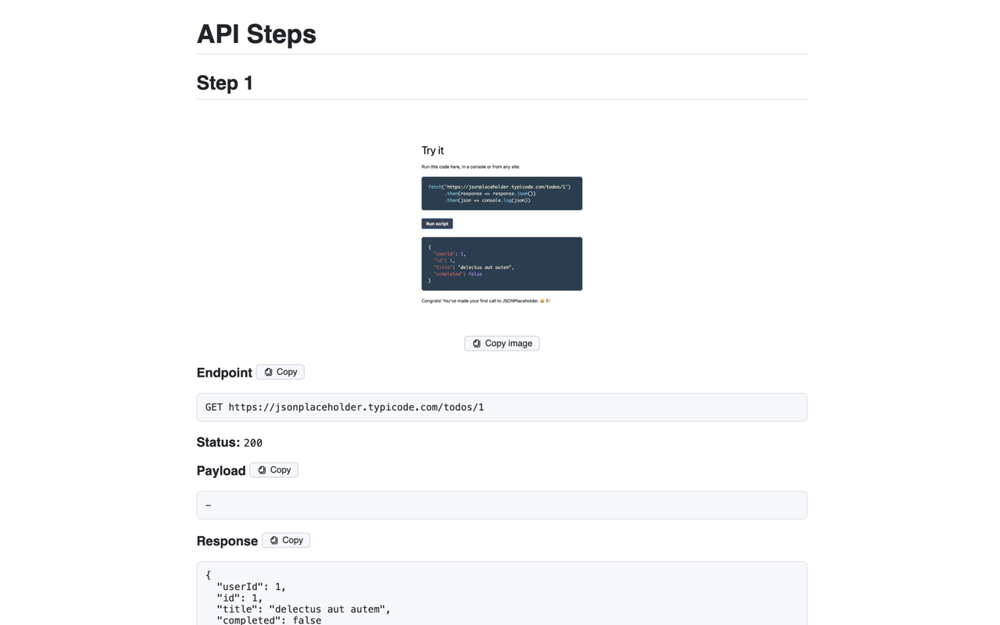

# API Step Exporter

Chrome DevTools extension: pick API requests from the Network tab, capture a
screenshot per step, and export the whole flow as a Markdown or HTML
document — request, payload, response, and a picture of what the app looked
like at that step, side by side.

## Screenshots

**The DevTools panel** — request list, click-to-inspect detail panel with a collapsible JSON tree, and a captured step ready to export:

**Export ▾ menu** — curl or url/status format, each as Markdown or HTML:

**HTML export output** — screenshot, endpoint, payload, and response, each with its own working copy button:

## Features

- **DevTools panel** ("API Exporter" tab) lists network requests like the
  native Network panel — Name / Status / Type columns, a Fetch/XHR/Doc/CSS/
  JS/Font/Img/Media/Manifest/Socket/Wasm/Other type filter, URL search, and a
  one-click **clear list** button.
- **Auto screenshot capture** — for Fetch/XHR requests, a screenshot is taken
  automatically the moment the request finishes, so it reflects the page at
  that exact moment instead of whenever you later select the row.
- **Capture Step** / **Capture All (filtered)** — add one request or every
  currently filtered request to your step list in one go, with a live
  "Capturing N of M…" progress indicator for batches.
- **Click-to-inspect detail panel** — click any request in the list to open a
  resizable, closable panel (drag its top edge, like DevTools' own split
  panes) with a collapsible, color-coded JSON tree for payload and response.
- **Step table** — each captured step shows its thumbnail, method + status,
  API name, and URL. Per step: a 👁 button opens a modal with the full-size
  screenshot plus the same JSON tree for payload/response (each in its own
  scroll box, so a long response doesn't push the image off-screen), a ✎
  button lets you swap the screenshot for your own image, and 🗑 removes it.
- **Binary-safe** — file uploads and other binary bodies are detected (by
  non-printable character ratio) and replaced with a short placeholder
  instead of dumping unreadable bytes.
- **Export** — a single Export ▾ menu: pick curl-style or plain url/status
  format, each as Markdown or a standalone HTML file (the HTML export
  includes working copy buttons; most Markdown viewers strip embedded
  `<script>`, so `.md` stays plain). An "Include images" checkbox controls
  whether screenshots are embedded at all.
- **Light/dark theme**, follows DevTools' own theme with a manual override.

## Install (unpacked)

Built on Manifest V3 + the `chrome.devtools.*` APIs, so it loads the same way
on any Chromium-based browser, and also runs on Firefox — its DevTools panel
document doesn't expose `browser.tabs` directly, so screenshot capture is
relayed through `background.js` there instead. Safari is not supported —
its extension platform requires a real Xcode-based port.

### Chrome

1. Open `chrome://extensions`
2. Enable **Developer mode** (top right)
3. Click **Load unpacked**, select this folder
4. Open DevTools on any page — a new **API Exporter** tab appears

### Microsoft Edge

1. Open `edge://extensions`
2. Enable **Developer mode** (left sidebar)
3. Click **Load unpacked**, select this folder
4. Open DevTools on any page — a new **API Exporter** tab appears

### Brave

1. Open `brave://extensions`
2. Enable **Developer mode** (top right)
3. Click **Load unpacked**, select this folder
4. Open DevTools on any page — a new **API Exporter** tab appears

### Opera

1. Open `opera://extensions`
2. Enable **Developer mode** (top right)
3. Click **Load unpacked**, select this folder
4. Open DevTools on any page — a new **API Exporter** tab appears

### Firefox

1. Open `about:debugging#/runtime/this-firefox`
2. Click **Load Temporary Add-on…**
3. Select `manifest.json` inside this folder (the file, not the folder)
4. Open DevTools (F12) on any page — a new **API Exporter** tab appears

This load is temporary — it's removed when Firefox restarts, so you'll
repeat these steps each session. A permanent install requires the extension
to be signed by Mozilla (submitted via addons.mozilla.org, listed or
self-distributed).

## Usage

1. Trigger the API call(s) you want to document
2. Click a request in the list (or use **Capture All (filtered)** to grab
   everything matching the current search/type filter)
3. Click **Capture Step** to add it to your export
4. In the step table: 👁 to review a step in full, ✎ to swap its screenshot,
   🗑 to remove it
5. Pick a format from **Export ▾** — curl or url/status, Markdown or HTML

## License

MIT — see [LICENSE](LICENSE).
